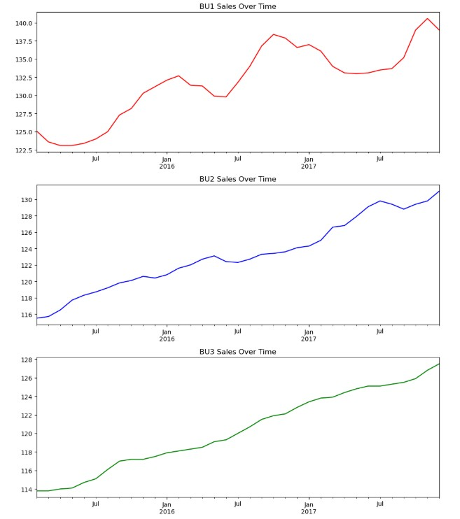

## 📈 Monthly Sales Forecasting (ARIMA Modeling)

A comprehensive time series analysis project predicting the monthly sales for three distinct Business Units (BU1, BU2, and BU3) of a major US-based processed food manufacturer.   This project showcases end-to-end expertise in cleaning, analyzing, and modeling non-stationary time series data using advanced statistical methods in Python.

---

### 🎯 Project Goal

The primary objective was to develop robust ARIMA models to forecast sales for **January, February and March 2018** for three separate Business Units (BU1, BU2, BU3) based on historical data spanning from February 2015 to January 2018.

---

### 🛠️ Technical Stack

* **Language:** Python
* **Core Libraries:** `pandas`, `numpy`, `matplotlib`, `statsmodels`
* **Time Series/Statistics Libraries:** `arch` (for ADF test), `pmdarima` (for Auto-ARIMA), `statsmodels.stats.diagnostic` (for Ljung-Box test)

---

### 🚀 Methodology & Key Features

#### 1. Data Preparation and Initial Analysis
* **Data Source:** `USA_Firm_Sales_data.csv`
* **Cleaning:** Ensured no missing values (`NaN`s) were present in the dataset.
* **Time Series Indexing:** Converted the `Year` and `Month` columns into a proper datetime index for accurate time series processing.
* **Visualization:** Initial plotting revealed clear **non-stationarity** in all three series, characterized by visible upward trends.

| Original Time Series Plot |
| :---: |
|  |
| *Caption: Plot of the three raw time series (BU1, BU2, BU3) over time, showing non-stationarity with an evident upward trend.* |

#### 2. Stationarity Testing & Differencing
* **Formal Test:** Applied the **Augmented Dickey-Fuller (ADF) test** to formally confirm non-stationarity for each series.
    * *Result:* ADF p-values were **1.000** for all BUs, confirming the need for differencing.
* **Optimal Differencing:** Used the `pmdarima` library's `ndiffs` function to automatically determine the minimum number of differences required.
    * *Result:* All three series (BU1, BU2, and BU3) required **1st-order differencing** (`d=1`) to achieve stationarity.

#### 3. Optimal Model Selection (Auto-ARIMA)
The `pmdarima` library's `auto_arima` function was employed to efficiently search for the optimal ARIMA(p,d,q) parameters that minimized the **Akaike Information Criterion (AIC)**.

| Business Unit | Optimal ARIMA Model | Interpretation |
| :---: | :---: | :---: |
| **BU1** | `ARIMA(0, 1, 0)` | A **Random Walk** model, implying the best prediction for tomorrow is today's value (d=1, p=0, q=0). |
| **BU2** | `ARIMA(0, 1, 1)` | A **Moving Average (MA)** model with first-order differencing. |
| **BU3** | `ARIMA(0, 1, 0)` | A **Random Walk** model, similar to BU1. |

#### 4. Model Validation
* **Ljung-Box Q-Test:** Performed this test on the residuals of the best-fit models to confirm they are **white noise** (random errors), a necessary condition for a reliable forecast.
* *Validation:* The BU2 model successfully passed the test (high p-values), confirming the model effectively captured the underlying autocorrelation.

#### 5. Final Forecasting

The selected and validated ARIMA models were used to generate the 3-month sales forecast for 2018.

**Final Sales Forecasts (Millions USD):**

| Month | BU1 Forecast | BU2 Forecast | BU3 Forecast |
| :---: | :---: | :---: | :---: |
| **Jan 2018** | 137.99 | 131.72 | 127.95 |
| **Feb 2018** | 137.99 | 132.18 | 128.35 |
| **Mar 2018** | 137.99 | 132.64 | 128.75 |

---

### 📚 Repository Contents

* `Monthly_Sales_Forecasting.ipynb`: The main Jupyter Notebook containing all the code, analysis, visualizations and model building steps.
* `USA_Firm_Sales_data.csv`: The source dataset used for the analysis.
* `raw_time_series_plot` : The plot showing BU1, BU2 and BU3 sales all together from 2015 to 2018.

---
